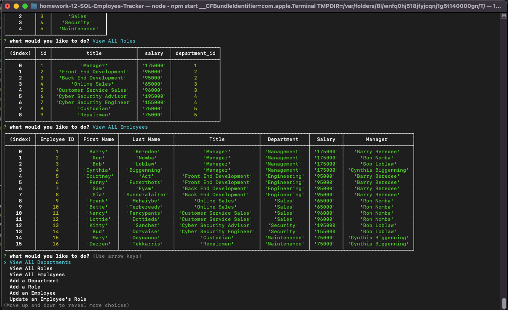

# homework-12-SQL-Employee-Tracker

SQL - SQL Employee Tracker

Git Hub: https://github.com/minutemin/homework-12-SQL-Employee-Tracker

Video Link: https://drive.google.com/file/d/1i55Fch5BTK0t3MGreec9qwqCUndK83So/view

## Badges

## Table of Contents
- [Description](#description)
- [Installation](#installation)
- [Usage](#usage)
- [Credits](#credits)
- [License](#license)

## Description

This homework assignment on SQL is to create a employee database where there tables for departments, roles, and employees.  You are able to view each table, add to them and update the role of an employee.  I have also added as a bonus features to be able to delete a department, role and an employee. 

## Installation

You will need to install npm. This will install the mysql and inquirer packages as well.  Then you will need to sign into mysql and source the schema and seeds sql file.  From there, you can quit out of mysql and then start npm which will start the application. 

## Usage

To use this app, follow the installation instructions above.  Once you start npm by typing in "npm start" in the command line, inquirer will prompt the inital question and give you a list of actions to pick from.  
When you select to view all the departments, a table of all the departments will be displayed.  
When you select to view all of the roles, a table of all the roles are displayed.  
When you select to view all of the employees, a table of all employees are displayed.  
When you select that you want to add a new department, it will then ask you what the name of the department is, and will be added to the database.  
When you select you want to add a new role, it will then ask what the name of the role is, and how much the salary is, and what department the role belongs to and then is added to the table. 
When you select to add a new employee.  They will be given an id number automatically. You will be asked for their first name, last name, what role they have and who their manager is.  
When you select to update the role of a specific employee, it will ask you which role you want them to be upgraded to. This will also change their salary to whatever the salary is for the new role. 
I have also included for more practice, options to delete a department, role or an employee.  
When you select delete a department, it will ask you to pick which department you want to remove and it will drop it from the table.
When you select delete a role, it will ask you which role you want to delete and then drop it from the table. 
When you select to delete an employee, it will ask you which employee from a list to delete from the database.  

## Credits

Sam Randolph is my instructor and gave us a demo to get the project started.
Abdullah Al Hilfi is my tutor that has also helped me with this assignment. 
The TA's in my class also helped me debug some issues. 

## License
Please refer to the link below if you need to read the terms and conditions of the license:
* [MIT license](https://choosealicense.com/licenses/mit/)

